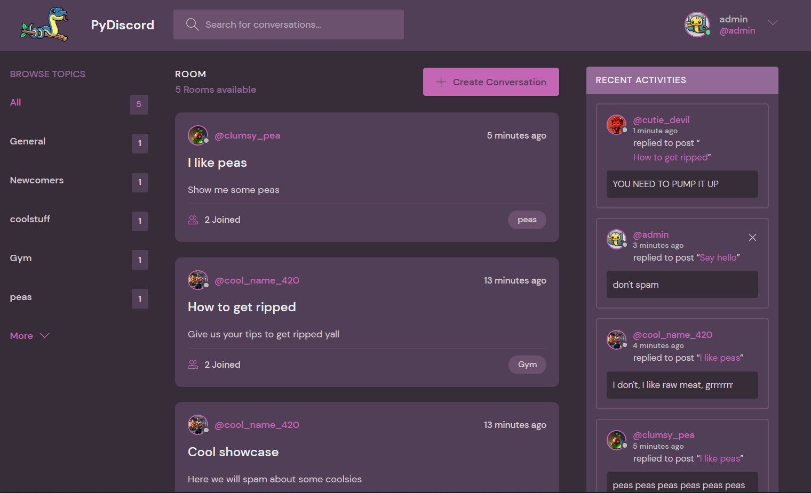
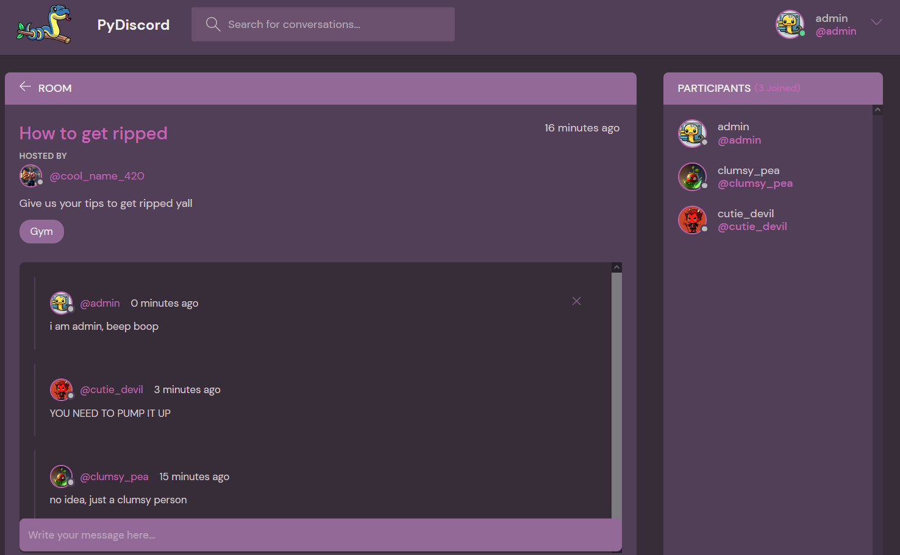
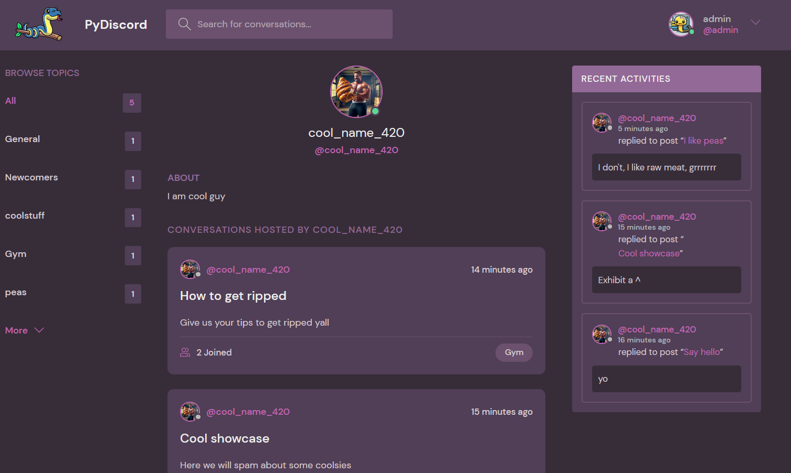
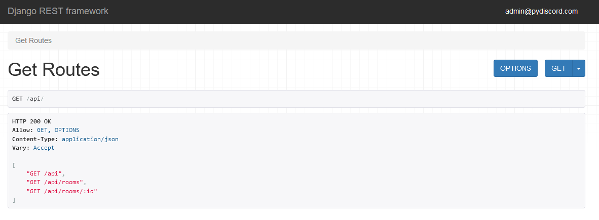

#  PyDiscord
Yet another Discord ripoff in Python for fooling around with Django.

## What can you do with it?
- Get a sneakpeak how can you create something similar in Django
- CRUD some conversations/messages
- Talk with yourself using different accounts
- Pretend to be a site admin
- Curl some request to basic API
- Clone repo and add some more functionalities for yourself

## How to run it?

```
1. python -m pip install -r requirements.txt
2. python utils/super_super_env.py --name your_name --email your@email.com --password your_pwd
3. python manage.py migrate
4. python manage.py runserver localhost:8000
```

If you just want to run it with default config for superuser replace command in `2.` with `python utils/super_super_env.py`

Then you can create users, rooms

## How does it look with some users?
### Main


In order to see this, you would need to create new users, apart from the existing admin, give them some avatars and populate rooms/conversations.
Or I could upload the `db.sqlite3` if there was a need for it.

### Room


Some random conversation between random profiles.

### Profile


Example profile page of the big croissant guy.

### API


Very complicated API with endpoints for getting all the rooms or some particular by its id.

CSS and style inspired by Dennis Ivy one